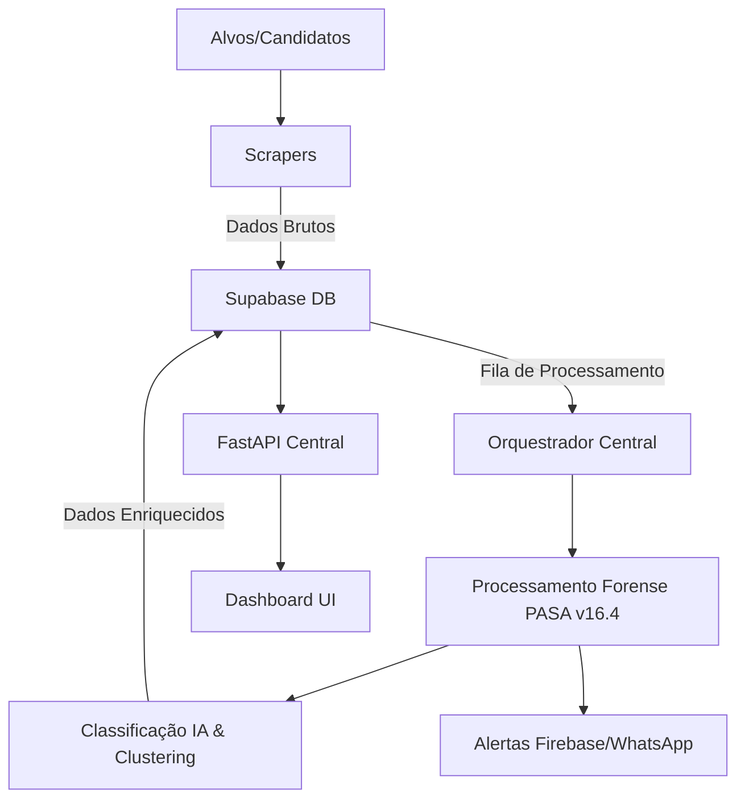

# 🗺️ Mapa de Arquitetura: Sentinela Democrática v18.5+

## 1. Visão Geral
O Sentinela Democrática é uma plataforma de inteligência cibernética para monitoramento de desinformação e discurso de ódio em contextos eleitorais.

## 2. Diagrama de Fluxo de Dados (DFD)

## 3. Componentes Principais

### 3.1 Camada de Coleta (Scrapers)
- **Instagram Headless**: `core/instagram_headless.py` (Playwright) - Extração dinâmica de comentários.
- **Instagram Scrapy**: `sentinela_scraper/spiders/instagram.py` - Coleta massiva baseada em spiders.
- **Meta Ads**: `core/meta_ad_scraper.py` - Monitoramento de anúncios políticos.

### 3.2 Camada de Inteligência (PASA & Workers)
- **Orquestrador**: `core/orquestrador.py` - Coordena o fluxo entre coleta e análise.
- **PASA Auditor**: `core/pasa_auditor.py` - Implementa o rigor criminal na análise de ódio.
- **Data Miner**: `processing/data_miner.py` - Detecção de picos de agressividade e clusters de coordenação.

### 3.3 Camada de API (Backend)
- **FastAPI**: `api/index.py` - Interface REST para consumo de dados e métricas.
- **Admin**: `api/v1/admin/` - Gerenciamento de alvos e triagem manual.

### 3.4 Interface (Frontend)
- **Dashboard**: `src/core/ui.js` - Renderização de cards de alerta e métricas de impacto.
- **Métricas**: `src/components/WorkersMetricsDashboard.jsx` - Monitoramento de performance em tempo real.

## 4. Pilha Tecnológica
- **Linguagem**: Python 3.12+, JavaScript (ES6+).
- **Banco de Dados**: Supabase (PostgreSQL).
- **Framework Web**: FastAPI, React.
- **Automação**: Playwright, Scrapy.
- **Cloud/Infra**: Firebase (Alertas).

## 5. Governança Forense
O sistema opera sob o **Protocolo PASA v16.4**, garantindo que toda classificação de ódio siga critérios jurídicos e forenses estritos para uso em perícias oficiais.
