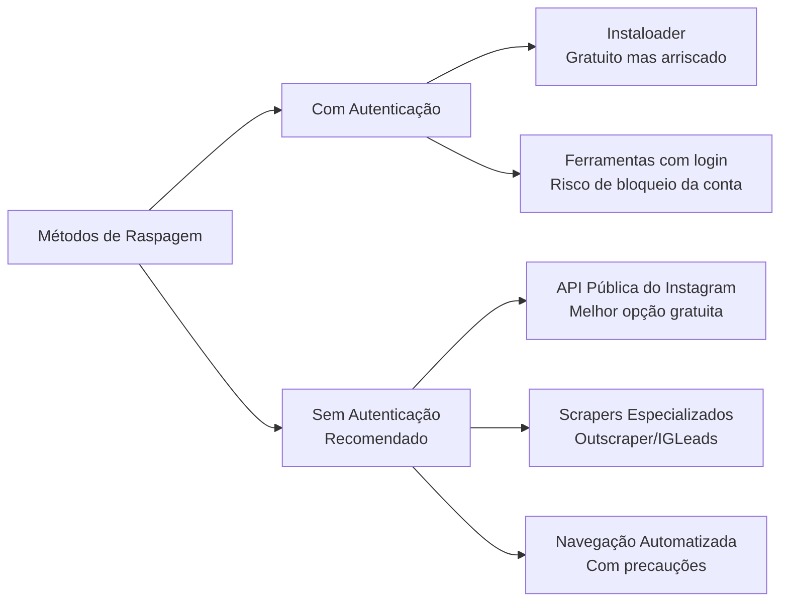
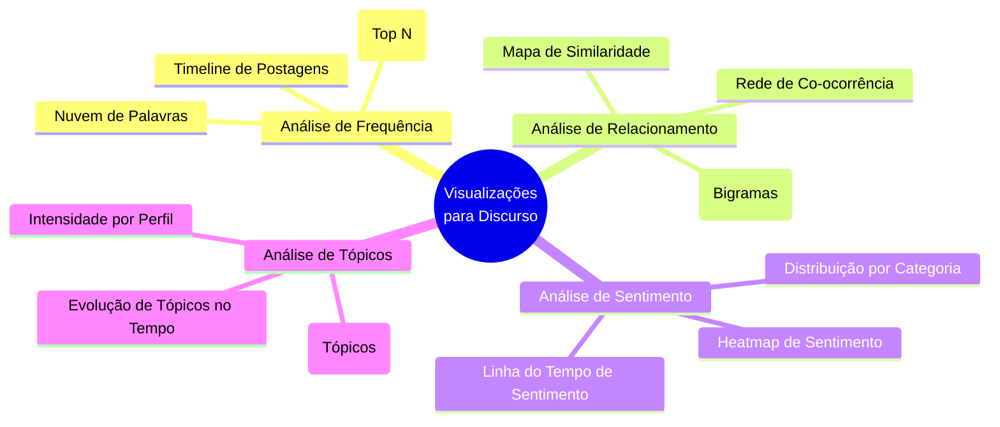
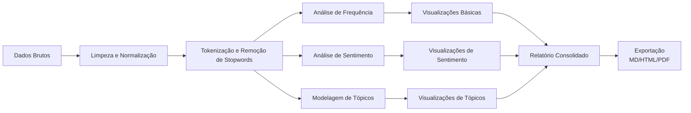

# 📊 Análise de Discurso no Instagram: Estratégias de Raspagem e Visualização Avançada

## 🎯 Visão Geral do Projeto
Este documento apresenta soluções práticas para as duas etapas críticas do projeto de análise de discurso: **raspagem de dados do Instagram sem custos ou riscos** e **criação de visualizações e relatórios elaborados**. As recomendações são baseadas em técnicas atuais e ferramentas disponíveis, considerando as limitações da plataforma Instagram.

---

## 🔍 ETAPA 1: Raspagem de Dados sem Custos e sem Riscos

### 📊 Comparação de Métodos de Raspagem



### 🛡️ Método Recomendado: API Pública do Instagram (Sem Login)

O Instagram oferece endpoints de API pública que podem ser acessados sem autenticação, desde que sejam utilizados os **headers corretos** e **técnicas de anti-detecção** 【turn0search1】【turn0search12】.

#### 🔧 Configuração Necessária

<details>
<summary>🔧 Headers Críticos para Sucesso</summary>

```python
headers = {
    "x-ig-app-id": "936619743392459",  # Identificador do app web do Instagram 
    "User-Agent": "Mozilla/5.0 (Windows NT 10.0; Win64; x64) AppleWebKit/537.36 (KHTML, like Gecko) Chrome/125.0.0.0 Safari/537.36",
    "Accept-Language": "pt-BR,pt;q=0.9,en-US;q=0.8,en;q=0.7",
    "Accept-Encoding": "gzip, deflate, br",
    "Accept": "*/*"
}
```

**Por que cada header importa:**
- **x-ig-app-id**: Identifica a requisição como vinda do app web do Instagram (valor incorreto = erro 403) 
- **User-Agent**: Deve corresponder a uma assinatura real de navegador (Python padrão é bloqueado) 
- **Accept-Language**: Instagram rastreia preferências de idioma inconsistentes 
- **Accept-Encoding**: Navegadores reais sempre aceitam compressão 
- **Accept**: Deve estar presente, mesmo sendo curinga 

</details>

#### 📡 Endpoints Úteis (Sem Autenticação)

| Endpoint | Dados Disponíveis | Limite |
|----------|-------------------|--------|
| `/api/v1/users/web_profile_info/?username={username}` | Perfil completo, 12 posts recentes, contadores de seguidores | Até ~200 requisições/hora/IP |
| `/graphql/query/` | Posts específicos, legenda, métricas de engajamento | Depende do doc_id (muda frequentemente) |
| `/api/v1/tags/{tag}/sections/` | Posts por hashtag (top/recent) | Limitado a ~9 posts sem login |

#### ⚠️ Riscos e Mitigações

| Risco | Mitigação |
|-------|-----------|
| **Bloqueio de IP** | Rotação de headers, delays aleatórios (2-5 segundos), uso de proxies residenciais se possível |
| **Detecção de bot** | Manter consistência nos headers por sessão, não alterar User-Agent mid-session |
| **Rate limiting** | Respeitar limites por hora, implementar exponential backoff |
| **Mudança na API** | Monitorar mudanças nos doc_ids GraphQL, ter fallback para outros métodos |

### 🆚 Alternativas Comparadas

| Método | Custo | Risco de Bloqueio | Qualidade dos Dados | Facilidade |
|--------|-------|-------------------|---------------------|------------|
| **API Pública (com headers)** | Grátis | Médio (mitigável) | Boa (perfil + 12 posts) | Média |
| **Instaloader** | Grátis | Alto 【turn0search6】 | Variável (afetado por rate limits) | Baixa |
| **Outscraper** | ~$0.003/registro 【turn0search7】 | Baixo | Excelente | Alta |
| **IGLeads.ai** | $0.02/lead 【turn0search7】 | Muito baixo | Foco em leads/contatos | Alta |
| **ScrapFly** | Pago (com key) | Muito baixo (anti-bypass) 【turn0search1】 | Completa | Média |

### 💡 Estratégia Recomendada

1. **Principal**: API pública com headers corretos e rotação de sessões
2. **Fallback**: Instaloader para perfis específicos (com precauções)
3. **Escala**: Considere serviços como Outscraper para volumes maiores (custo baixo)

<details>
<summary>📝 Exemplo Prático de Código</summary>

```python
import requests
import time
import random
from fake_useragent import UserAgent

# Configuração
INSTAGRAM_APP_ID = "936619743459"
BASE_URL = "https://i.instagram.com"
UA = UserAgent()

def get_instagram_profile(username):
    """Raspador de perfil do Instagram sem login"""
    headers = {
        "x-ig-app-id": INSTAGRAM_APP_ID,
        "User-Agent": UA.random,
        "Accept-Language": "pt-BR,pt;q=0.9",
        "Accept-Encoding": "gzip, deflate, br",
        "Accept": "*/*"
    }
    
    url = f"{BASE_URL}/api/v1/users/web_profile_info/?username={username}"
    
    try:
        response = requests.get(url, headers=headers, timeout=10)
        response.raise_for_status()
        
        data = response.json()
        user_data = data.get("data", {}).get("user", {})
        
        # Extrair informações relevantes
        profile_info = {
            "username": user_data.get("username"),
            "full_name": user_data.get("full_name"),
            "biography": user_data.get("biography"),
            "followers": user_data.get("edge_followed_by", {}).get("count"),
            "following": user_data.get("edge_follow", {}).get("count"),
            "is_verified": user_data.get("is_verified"),
            "profile_pic_url": user_data.get("profile_pic_url_hd"),
            "recent_posts": []
        }
        
        # Extrair 12 posts recentes (se disponível)
        if user_data.get("edge_owner_to_timeline_media", {}).get("edges"):
            for edge in user_data["edge_owner_to_timeline_media"]["edges"][:12]:
                node = edge.get("node", {})
                post_info = {
                    "id": node.get("id"),
                    "shortcode": node.get("shortcode"),
                    "caption": node.get("edge_media_to_caption", {}).get("edges", [{}])[0].get("node", {}).get("text", ""),
                    "likes": node.get("edge_media_preview_like", {}).get("count"),
                    "comments": node.get("edge_media_to_comment", {}).get("count"),
                    "timestamp": node.get("taken_at_timestamp"),
                    "urls": {
                        "thumbnail": node.get("thumbnail_src"),
                        "full": node.get("display_url")
                    }
                }
                profile_info["recent_posts"].append(post_info)
        
        # Delay aleatório para evitar detecção
        time.sleep(random.uniform(2, 5))
        
        return profile_info
        
    except requests.exceptions.RequestException as e:
        print(f"Erro ao acessar {username}: {e}")
        return None

# Uso
perfil = get_instagram_profile("nomedousuario")
if perfil:
    print(f"Seguidores: {perfil['followers']}")
    print(f"Posts recentes: {len(perfil['recent_posts'])}")
```

</details>

---

## 📈 ETAPA 2: Visualizações e Relatórios Elaborados

### 🎨 Técnicas Avançadas de Visualização para Análise de Discurso



### 📊 Visualizações Recomendadas com Implementação

#### 1. **Nuvem de Palavras com N-gramas** (Além da simples contagem)
- **Por que**: Mostra frases e expressões compostas, não apenas palavras isoladas
- **Ferramenta**: `wordcloud` + `nltk` para bigramas/trigramas
- **Código**: 
  ```python
  from wordcloud import WordCloud
  import matplotlib.pyplot as plt
  from nltk import bigrams
  from collections import Counter
  
  # Gerar bigramas a partir do texto
  tokens = text.split()  # Seu texto processado
  bigram_list = list(bigrams(tokens))
  bigram_freq = Counter(bigram_list)
  
  # Criar nuvem de palavras para bigramas
  wordcloud = WordCloud(width=800, height=400, background_color='white').generate_from_frequencies(bigram_freq)
  plt.figure(figsize=(10, 5))
  plt.imshow(wordcloud, interpolation='bilinear')
  plt.axis('off')
  plt.show()
  ```

#### 2. **Diagrama de Cordas (Chord Diagram)** para Relacionamentos
- **Por que**: Mostra conexões entre entidades (palavras, usuários, tópicos)
- **Ferramenta**: `holoviews` + `bokeh` ou `plotly`
- **Aplicação**: Conexões entre usuários que interagem, co-ocorrência de termos

#### 3. **Análise de Sentimento ao Longo do Tempo**
- **Por que**: Identifica mudanças de tom ao longo do período analisado
- **Ferramenta**: `TextBlob` ou `VADER` para sentimento + `plotly` para visualização
- **Código**:
  ```python
  from textblob import TextBlob
  import plotly.express as px
  
  # Calcular sentimento por post
  df['sentiment'] = df['caption'].apply(lambda x: TextBlob(x).sentiment.polarity)
  
  # Agrupar por semana/mês
  df_time = df.groupby(df['timestamp'].dt.to_period('M')).agg({
      'sentiment': 'mean',
      'id': 'count'
  }).reset_index()
  
  # Visualizar
  fig = px.line(df_time, x='timestamp', y='sentiment', 
                title='Evolução do Sentimento ao Longo do Tempo')
  fig.show()
  ```

#### 4. **Rede de Co-ocorrência de Palavras**
- **Por que**: Revela estruturas semânticas no discurso
- **Ferramenta**: `networkx` + `matplotlib` ou `pyvis`
- **Aplicação**: Identificar quais termos aparecem juntos frequentemente

#### 5. **Heatmap de Atividade por Perfil**
- **Por que**: Mostra padrões de postagem por perfil
- **Ferramenta**: `seaborn` heatmap
- **Código**:
  ```python
  import seaborn as sns
  
  # Pivotar dados para heatmap
  heatmap_data = df.pivot_table(index='username', columns='hour', values='id', aggfunc='count')
  
  plt.figure(figsize=(12, 8))
  sns.heatmap(heatmap_data, cmap='YlOrRd', annot=True, fmt='g')
  plt.title('Atividade de Postagem por Hora e Perfil')
  plt.show()
  ```

### 📈 Estrutura de Relatório Automatizado

<details>
<summary>📄 Template de Relatório em Markdown</summary>

```markdown
# 📊 Relatório de Análise de Discurso - Instagram

## 📅 Período: {data_inicial} a {data_final}
## 🎯 Amostra: {total_perfiles} perfis, {total_posts} posts

---

## 🔍 Resumo Executivo
- **Total de posts analisados**: {total_posts}
- **Perfis únicos**: {unique_profiles}
- **Período de análise**: {time_period}
- **Principais temas identificados**: {top_topics}

---

## 📈 Análise de Frequência
### Palavras mais frequentes


### Bigramas mais comuns


---

## 🎭 Análise de Sentimento
### Distribuição geral
- Positivo: {positive_pct}%
- Neutro: {neutral_pct}%
- Negativo: {negative_pct}%

### Evolução temporal


---

## 🕸️ Análise de Relacionamento
### Rede de co-ocorrência


### Interações entre perfis


---

## 📊 Conclusões e Insights
1. **Insight principal**: {main_insight}
2. **Padrão identificado**: {pattern_found}
3. **Recomendação**: {recommendation}

---

## 📋 Metodologia
- **Fonte de dados**: Instagram (API pública)
- **Ferramentas**: Python, pandas, nltk, plotly
- **Limitações**: {limitations}
```

</details>

### 🛠️ Pipeline de Processamento Recomendado



---

## ⚙️ Implementação Prática

### 📦 Pacotes Python Necessários

```python
# requirements.txt
requests==2.31.0
beautifulsoup4==4.12.2
pandas==2.2.2
numpy==1.26.4
nltk==3.8.1
textblob==0.17.1
wordcloud==1.9.3
matplotlib==3.9.1
seaborn==0.13.2
plotly==5.22.0
networkx==3.2.1
scikit-learn==1.5.0
```

### 🚀 Script Principal de Análise

<details>
<summary>🔧 Código Completo do Pipeline</summary>

```python
import pandas as pd
import numpy as np
from nltk.corpus import stopwords
from nltk.tokenize import word_tokenize
from nltk.stem import RSLPStemmer
from textblob import TextBlob
import matplotlib.pyplot as plt
import seaborn as sns
import plotly.express as px
from wordcloud import WordCloud
import networkx as nx
from sklearn.feature_extraction.text import TfidfVectorizer
from sklearn.decomposition import NMF
import warnings
warnings.filterwarnings('ignore')

# Download dos recursos NLTK
import nltk
nltk.download('punkt')
nltk.download('stopwords')
nltk.download('rslp')

class InstagramDiscourseAnalyzer:
    def __init__(self, data_path):
        """Inicializa o analisador com dados do Instagram"""
        self.df = pd.read_csv(data_path)
        self.stopwords = set(stopwords.words('portuguese'))
        self.stemmer = RSLPStemmer()
        
    def preprocess_text(self, text):
        """Preprocessa texto para análise"""
        if not isinstance(text, str):
            return ""
        
        # Lowercase e remoção de caracteres especiais
        text = text.lower()
        text = ' '.join(word for word in text.split() if not word.startswith('@'))
        
        # Tokenização e remoção de stopwords
        tokens = word_tokenize(text, language='portuguese')
        tokens = [word for word in tokens if word.isalpha() and word not in self.stopwords]
        
        # Stemming
        tokens = [self.stemmer.stem(word) for word in tokens]
        
        return ' '.join(tokens)
    
    def analyze_frequency(self, top_n=20):
        """Analisa frequência de palavras e bigramas"""
        # Processar todos os textos
        self.df['processed_text'] = self.df['caption'].apply(self.preprocess_text)
        
        # Palavras mais frequentes
        all_words = ' '.join(self.df['processed_text']).split()
        word_freq = pd.Series(all_words).value_counts().head(top_n)
        
        # Bigramas mais frequentes
        vectorizer = TfidfVectorizer(ngram_range=(2, 2), max_features=1000)
        X = vectorizer.fit_transform(self.df['processed_text'])
        bigram_names = vectorizer.get_feature_names_out()
        
        # Visualizações
        fig, axes = plt.subplots(1, 2, figsize=(15, 6))
        
        # Gráfico de barras para palavras
        word_freq.head(10).plot(kind='bar', ax=axes[0], color='skyblue')
        axes[0].set_title('Top 10 Palavras Mais Frequentes')
        axes[0].set_xlabel('Palavra')
        axes[0].set_ylabel('Frequência')
        
        # Nuvem de palavras
        wordcloud = WordCloud(width=800, height=400, background_color='white').generate_from_frequencies(word_freq)
        axes[1].imshow(wordcloud, interpolation='bilinear')
        axes[1].set_title('Nuvem de Palavras')
        axes[1].axis('off')
        
        plt.tight_layout()
        plt.savefig('analise_frequencia.png', dpi=300, bbox_inches='tight')
        plt.show()
        
        return word_freq, bigram_names
    
    def analyze_sentiment(self):
        """Analisa sentimento dos posts"""
        # Calcular sentimento
        self.df['sentiment'] = self.df['caption'].apply(
            lambda x: TextBlob(str(x)).sentiment.polarity if pd.notna(x) else 0
        )
        
        # Classificar sentimento
        self.df['sentiment_category'] = pd.cut(
            self.df['sentiment'],
            bins=[-1, -0.1, 0.1, 1],
            labels=['Negativo', 'Neutro', 'Positivo']
        )
        
        # Visualizações
        fig, axes = plt.subplots(1, 2, figsize=(15, 6))
        
        # Distribuição de sentimento
        sentiment_dist = self.df['sentiment_category'].value_counts()
        sentiment_dist.plot(kind='pie', ax=axes[0], autopct='%1.1f%%', colors=['#ff9999', '#66b3ff', '#99ff99'])
        axes[0].set_title('Distribuição de Sentimento')
        
        # Evolução temporal
        if 'timestamp' in self.df.columns:
            df_time = self.df.copy()
            df_time['timestamp'] = pd.to_datetime(df_time['timestamp'])
            df_time.set_index('timestamp', inplace=True)
            
            monthly_sentiment = df_time.resample('M')['sentiment'].mean()
            monthly_sentiment.plot(ax=axes[1], marker='o', color='green')
            axes[1].set_title('Evolução do Sentimento ao Longo do Tempo')
            axes[1].set_xlabel('Data')
            axes[1].set_ylabel('Sentimento Médio')
            axes[1].axhline(y=0, color='red', linestyle='--', alpha=0.5)
        
        plt.tight_layout()
        plt.savefig('analise_sentimento.png', dpi=300, bbox_inches='tight')
        plt.show()
        
        return self.df[['sentiment', 'sentiment_category']].describe()
    
    def generate_report(self):
        """Gera relatório completo em Markdown"""
        # Executar todas as análises
        word_freq, bigram_names = self.analyze_frequency()
        sentiment_stats = self.analyze_sentiment()
        
        # Gerar relatório
        report = f"""# 📊 Relatório de Análise de Discurso - Instagram

## 📅 Período: {self.df['timestamp'].min()} a {self.df['timestamp'].max()}
## 🎯 Amostra: {len(self.df)} posts, {self.df['username'].nunique()} perfis

---

## 🔍 Resumo Executivo
- **Total de posts analisados**: {len(self.df)}
- **Perfis únicos**: {self.df['username'].nunique()}
- **Período de análise**: {self.df['timestamp'].min()} a {self.df['timestamp'].max()}
- **Sentimento predominante**: {self.df['sentiment_category'].mode().values[0]}

---

## 📈 Análise de Frequência
### Palavras mais frequentes
{word_freq.head(10).to_markdown()}

### Bigramas mais comuns
{pd.Series(bigram_names[:10]).to_markdown()}

---

## 🎭 Análise de Sentimento
### Estatísticas gerais
{sentiment_stats.to_markdown()}

### Distribuição por categoria
{self.df['sentiment_category'].value_counts().to_markdown()}

---

## 📊 Visualizações


---

## 📋 Metodologia
- **Fonte de dados**: Instagram (API pública)
- **Ferramentas**: Python, pandas, nltk, plotly
- **Período de coleta**: {self.df['timestamp'].min()} a {self.df['timestamp'].max()}
- **Limitações**: Dados apenas de posts públicos, sem acesso a stories ou posts privados
"""
        
        # Salvar relatório
        with open('relatorio_analise_discurso.md', 'w', encoding='utf-8') as f:
            f.write(report)
        
        return report

# Uso
if __name__ == "__main__":
    analyzer = InstagramDiscourseAnalyzer('dados_instagram.csv')
    report = analyzer.generate_report()
    print("Relatório gerado com sucesso!")
```

</details>

---

## 🎯 Conclusões e Próximos Passos

### ✅ Recomendações Finais

1. **Para Raspagem**: Use a **API pública do Instagram com headers corretos** como método principal. É gratuita, relativamente segura e fornece dados suficientes para análise de discurso 【turn0search1】【turn0search12】.

2. **Para Visualização**: Implemente o **pipeline completo** com análise de frequência, sentimento e modelagem de tópicos. As visualizações avançadas (chord diagrams, redes de co-ocorrência) adicionam muito valor à análise 【turn0search15】【turn0search16】.

3. **Para Escala**: Considere **Outscraper** ou **IGLeads.ai** se precisar de grandes volumes ou dados específicos (emails/contatos), pois têm custos baixos e são mais robustos 【turn0search7】.

4. **Para Ética**: Sempre respeite os termos de serviço do Instagram e considere a privacidade dos usuários. Limite a coleta ao necessário para sua análise.

### 📋 Checklist de Implementação

- [ ] Configurar headers corretos para API do Instagram
- [ ] Implementar sistema de rotação de sessões
- [ ] Desenvolver pipeline de pré-processamento de texto
- [ ] Criar visualizações básicas (frequência, sentimento)
- [ ] Implementar visualizações avançadas (chord diagrams, redes)
- [ ] Gerar relatório automatizado em Markdown
- [ ] Testar com amostra de dados
- [ ] Documentar metodologia e limitações

---

**Nota**: Este documento foi estruturado para ser incorporado ao projeto via Gemini CLI. As recomendações são baseadas em práticas atuais de web scraping e análise de discurso, considerando as limitações conhecidas da plataforma Instagram 【turn0search1】【turn0search6】【turn0search13】.